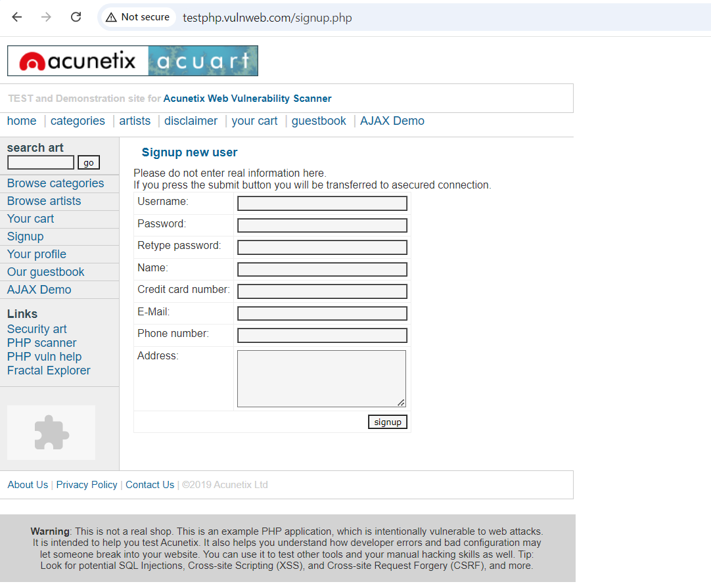

<h1>Sniffing Usernames & Passwords From Web Pages & Remote Servers</h1>


<h2>Description</h2>
In this project, we will be exploring how to use Wireshark for sniffing and analyzing network traffic. The goal is to understand the flow of data over unsecured protocols such as FTP and HTTP, which can expose usernames and passwords in plain text. This exercise offers a comprehensive introduction to the basics of network monitoring and packet analysis, demonstrating how easily sensitive information can be intercepted if not properly secured. This setup provides a practical insight into the importance of encryption and secure communication protocols in protecting data integrity and privacy. <br />


<h2>Languages and Utilities Used</h2>

- <b>Wireshark</b> 

<h2>Takeaways</h2>

- <b>Wireshark Packet Sniffing and Analysis</b>: Successfully used Wireshark to capture and analyze network packets, demonstrating the exposure of usernames and passwords transmitted via unencrypted protocols such as FTP and HTTP. This project enhanced understanding of network protocol vulnerabilities and the critical need for secure communications.

- <b>Identification and Analysis of Unsecured Traffic</b>: Gained hands-on experience in identifying and interpreting unsecured traffic patterns, which emphasized the importance of encryption to safeguard data during transmission. This takeaway underscores the significance of deploying secure protocols like HTTPS to prevent data interception and enhance cybersecurity measures.

- <b>Insights into Network Security Measures</b>: Through the direct application of packet sniffing, developed a deeper insight into the practical aspects of cybersecurity, such as the detection of sensitive information in plaintext. This experience highlighted the practical implications of network security, promoting proactive measures to enhance data protection strategies.


<h2>Program walk-through:</h2>

<p align="center">
Sample http website that I will put login details into and will be used for packet sniffing through wireshark: <br/>

<br />
<br />Created a .txt file containing list of possible passwords:  <br/>

<br />
<br />
Generated an MD5 hash tied to the password 'admin': <br/>

<br />
<br />
Successful verification of code executing and identifying 'admin' as the password stored within the hash:  <br/>

<br />
<br />
Successful verification of code executing and identifying 'admin' as the password stored within the hash:  <br/>

<br />
<br />
Successful verification of code executing and identifying 'admin' as the password stored within the hash:  <br/>

<br />
<br />
Successful verification of code executing and identifying 'admin' as the password stored within the hash:  <br/>

<br />
<br />
Successful verification of code executing and identifying 'admin' as the password stored within the hash:  <br/>

<br />
<br />
Successful verification of code executing and identifying 'admin' as the password stored within the hash:  <br/>

<br />
<br />
Successful verification of code executing and identifying 'admin' as the password stored within the hash:  <br/>

<br />
<br />
</p>


<!--
 ```diff   
- text in red
+ text in green
! text in orange
# text in gray
@@ text in purple (and bold)@@
```
--!>
